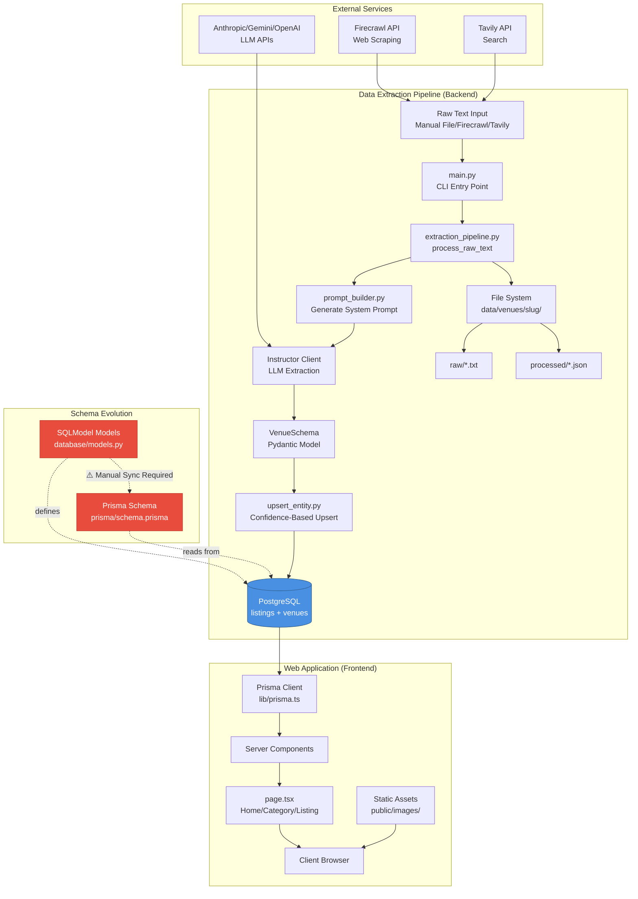

# Architecture Review - Edinburgh Finds Monorepo

**Last Updated:** December 2025
**Reviewed Stack:** Next.js 16.0.7, React 19.2.0, Prisma 7.1.0, SQLModel 0.0.27, Pydantic 2.11.10

---

## Executive Summary

Edinburgh Finds uses a **database-centric monorepo architecture** where a Python CLI backend writes data via SQLModel, and a Next.js frontend reads via Prisma. There is **no REST API** between the two applications.

**Strengths:**
- Simple architecture (no API layer to maintain)
- Type-safe on both sides (SQLModel + Prisma)
- Direct database access in Next.js Server Components (fast reads)

**Critical Risks:**
- Schema drift (manual sync required between Python and TypeScript)
- No caching layer (frontend hits database directly)
- Scalability bottlenecks (no connection pooling strategy for serverless)
- Security concerns (API keys in .env files)

---

## High-Level Architecture Diagram

```
┌─────────────────────────────────────────────────────────────────┐
│                    EDINBURGH FINDS MONOREPO                      │
├─────────────────────────────────────────────────────────────────┤
│                                                                  │
│  ┌────────────────────────┐       ┌──────────────────────────┐ │
│  │  BACKEND (Python)      │       │   WEB (Next.js 16)       │ │
│  │  Data Extraction CLI   │       │   Public Frontend        │ │
│  └────────────────────────┘       └──────────────────────────┘ │
│           │                                    │                │
│           │ SQLModel/SQLAlchemy               │ Prisma ORM     │
│           │ (writes)                          │ (reads)        │
│           ▼                                    ▼                │
│       ┌──────────────────────────────────────────┐             │
│       │         PostgreSQL Database              │             │
│       │  Tables: listings, venues                │             │
│       │  Source of Truth                         │             │
│       └──────────────────────────────────────────┘             │
│                                                                  │
│  ┌────────────────────────────────────────────────────────────┐│
│  │              EXTERNAL INTEGRATIONS                          ││
│  │                                                              ││
│  │  LLM APIs:                    Data Sources:                 ││
│  │  - Anthropic (Claude)         - Firecrawl (web scraping)    ││
│  │  - Gemini                     - Tavily (search API)         ││
│  │  - OpenAI                     - Manual file input           ││
│  └────────────────────────────────────────────────────────────┘│
└─────────────────────────────────────────────────────────────────┘
```

---

## Data Flow: End-to-End



---

## Scalability Concerns

### Critical Issues

#### 1. No API Gateway Between Backend and Frontend
**Problem:** Frontend reads directly from production database via Prisma.

**Impact:**
- No caching layer
- No rate limiting
- No request optimization
- Database becomes bottleneck as traffic grows
- Every page request = database query

**Example:**
```typescript
// edinburgh_finds_web/app/category/[slug]/page.tsx:21
const listings = await prisma.listings.findMany({
    where: { canonical_categories: { has: slug } }
})
// Direct DB hit on every page load, no cache
```

#### 2. No Pagination
**Problem:** Category pages load ALL listings without pagination.

**Impact:**
- Slow page loads as data grows
- Unbounded memory usage
- Poor UX for popular categories

**Fix:** Implement cursor-based pagination with `created_at` index.

#### 3. No Connection Pooling Strategy
**Current State:**
- Backend: Direct SQLAlchemy engine (`psycopg2-binary` synchronous)
- Frontend: Prisma with `PrismaPg` adapter

**Problem for Serverless:**
- Each function invocation creates new connections
- PostgreSQL connection exhaustion (default limit ~100)

**Solution:** Use PgBouncer or managed pooling (Neon, Supabase, AWS RDS Proxy)

#### 4. LLM Extraction - Sequential Processing
**Problem:** `extraction_pipeline.py` processes entities one at a time.

**Impact:** Limited throughput for bulk data ingestion.

**Fix:** Implement queue-based batch processing (Celery, BullMQ, or AWS SQS).

#### 5. File-Based Debug Logs
**Problem:** Raw text and JSON stored in local filesystem.

**Impact:**
- Filesystem bloat over time
- No centralized logging for production debugging
- Can't scale horizontally (logs split across instances)

**Fix:** Send logs to CloudWatch, Datadog, or structured logging service.

### Moderate Issues

#### 6. No CDN for Static Assets
**Problem:** Images served directly from Next.js.

**Fix:** Use Cloudinary, imgix, or Vercel's built-in image optimization.

#### 7. No Read Replicas
**Problem:** Single database handles both writes (backend) and reads (frontend).

**Impact:** Read traffic impacts write performance.

**Fix:** Configure PostgreSQL read replicas for frontend queries.

---

## Security Concerns

### Critical Issues

#### 1. API Keys in .env Files
**Risk:** Accidental git commit, local file access.

**Current Location:**
- `edinburgh_finds_backend/.env` - Anthropic, Gemini, Firecrawl, Tavily keys
- `edinburgh_finds_web/.env` - DATABASE_URL

**Mitigation:** Use AWS Secrets Manager, Azure Key Vault, or Doppler.

#### 2. Database Connection String Exposure
**Risk:** Connection strings in environment variables.

**Mitigation:** Use IAM-based authentication for PostgreSQL (supported by AWS RDS, Google Cloud SQL).

#### 3. No Input Validation on URL Slugs
**Problem:** `app/listing/[slug]/page.tsx` uses slug directly in Prisma query.

**Risk:** Potential SQL injection (Prisma mitigates but not guaranteed).

**Fix:** Add regex validation for slug format (`^[a-z0-9_-]+$`).

#### 4. No Rate Limiting
**Risk:** DDoS attacks, scraping abuse.

**Mitigation:** Implement Vercel/Cloudflare rate limiting.

### Moderate Issues

#### 5. Debug Mode Enabled in Production
**Problem:** `database/engine.py:5` has `echo=True` (logs all SQL queries).

**Risk:** Performance overhead, log bloat, potential data exposure.

**Fix:**
```python
engine = create_engine(
    settings.DATABASE_URL,
    echo=settings.DEBUG  # Only log in development
)
```

#### 6. External URL Trust
**Problem:** LLM-extracted URLs (`extraction_pipeline.py:28`) minimally validated.

**Risk:** XSS via malicious URLs (mitigated by Next.js, but still risky).

**Fix:** URL allowlist or stricter validation.

#### 7. No Content Security Policy (CSP)
**Risk:** XSS attacks.

**Fix:** Add CSP headers in `next.config.ts`.

---

## Dependency-Specific Findings (December 2025)

### New Concerns from requirements.txt Review

#### Pydantic 2.12.0 Breaking Change
**Current Version:** pydantic==2.11.10 ✅ Safe

**Issue:** [SQLModel breaks with Pydantic 2.12.0+](https://github.com/fastapi/sqlmodel/issues/1623)
- Database constraints (primary keys, unique keys) not created with Annotated types
- Regression introduced in Pydantic 2.12.0 (October 2025)

**Action Required:**
```txt
# requirements.txt - Add version cap
pydantic>=2.11.10,<2.12
```

#### SQLModel Async Limitation
**Current Setup:**
- SQLModel 0.0.27 + psycopg2-binary (synchronous)
- No asyncpg (asynchronous driver)

**Status:** ✅ Correct for current architecture (CLI tool, not web server)

**Future Consideration:** If adding FastAPI backend, will need:
```txt
asyncpg>=0.29.0
greenlet>=3.0.0  # Required for SQLAlchemy async
```

**References:**
- [Async SQLModel with PostgreSQL](https://daniel.feldroy.com/posts/til-2025-08-using-sqlmodel-asynchronously-with-fastapi-and-air-with-postgresql)
- [SQLAlchemy 2.0 Async Pooling](https://docs.sqlalchemy.org/en/20/core/pooling.html)

---

## Prioritized Refactor Suggestions

### Priority 1: Implement API Layer ⭐⭐⭐⭐⭐
**Urgency:** High
**Effort:** 2-3 days
**Impact:** Decouples frontend from database, enables caching

**Implementation:**
```python
# edinburgh_finds_backend/api/main.py
from fastapi import FastAPI
from fastapi.middleware.cors import CORSMiddleware

app = FastAPI(title="Edinburgh Finds API")

app.add_middleware(
    CORSMiddleware,
    allow_origins=["http://localhost:3000", "https://edinburghfinds.com"],
    allow_methods=["GET"],
    allow_headers=["*"],
)

@app.get("/api/listings/{slug}")
async def get_listing(slug: str):
    # Return listing with venue details
    pass

@app.get("/api/listings")
async def list_listings(category: str | None = None, limit: int = 20):
    # Return paginated listings
    pass
```

**Frontend Changes:**
```typescript
// edinburgh_finds_web/lib/api.ts
export async function getListing(slug: string) {
    const response = await fetch(`${API_BASE_URL}/api/listings/${slug}`, {
        next: { revalidate: 3600 }  // Cache 1 hour
    })
    return response.json()
}
```

**Benefits:**
- API-level caching (Redis, CDN edge)
- Rate limiting capability
- Authentication/authorization layer
- Independent scaling

### Priority 2: Automated Schema Synchronization ⭐⭐⭐⭐
**Urgency:** High
**Effort:** 1 day + CI/CD setup
**Impact:** Prevents production-breaking schema drift

**Implementation:**

1. **Backend as source of truth:**
```python
# scripts/create_tables.py
from database.engine import create_db_and_tables
create_db_and_tables()  # Applies SQLModel schema to PostgreSQL
```

2. **Frontend introspects database:**
```bash
cd edinburgh_finds_web
npx prisma db pull      # Updates prisma/schema.prisma from DB
npx prisma generate     # Regenerates TypeScript types
```

3. **CI/CD validation:**
```yaml
# .github/workflows/schema-sync.yml
name: Schema Sync Check
on: [pull_request]

jobs:
  check-schema-sync:
    runs-on: ubuntu-latest
    steps:
      - uses: actions/checkout@v3

      - name: Apply backend schema
        run: |
          cd edinburgh_finds_backend
          pip install -r requirements.txt
          python scripts/create_tables.py

      - name: Check Prisma schema synced
        run: |
          cd edinburgh_finds_web
          npx prisma db pull --force
          git diff --exit-code prisma/schema.prisma || \
            (echo "❌ Schema out of sync!" && exit 1)
```

### Priority 3: Add Pagination ⭐⭐⭐
**Urgency:** Medium
**Effort:** 1 day
**Impact:** Prevents slow page loads

**Implementation:**
```typescript
// app/category/[slug]/page.tsx
export default async function CategoryPage({ params, searchParams }) {
    const { slug } = await params
    const { cursor, limit = '20' } = await searchParams

    const listings = await prisma.listings.findMany({
        where: {
            canonical_categories: { has: slug },
            ...(cursor && { created_at: { lt: new Date(cursor) } })
        },
        orderBy: { created_at: 'desc' },
        take: parseInt(limit) + 1
    })

    const hasNextPage = listings.length > parseInt(limit)
    const displayListings = hasNextPage ? listings.slice(0, -1) : listings

    return (
        <>
            {displayListings.map(...)}
            {hasNextPage && <LoadMoreButton cursor={...} />}
        </>
    )
}
```

**Database Index:**
```python
# database/models.py
class Listing(SQLModel, table=True):
    # ...
    __table_args__ = (
        Index('idx_category_created', 'canonical_categories', 'created_at'),
    )
```

### Priority 4: Secrets Management ⭐⭐⭐⭐⭐
**Urgency:** High (security)
**Effort:** 1 day
**Impact:** Prevents API key leaks

**Option A: AWS Secrets Manager**
```python
# config/secrets.py
import boto3
import json
from functools import lru_cache

class SecretManager:
    @lru_cache(maxsize=1)
    def get_secrets(self, secret_name: str) -> dict:
        client = boto3.client('secretsmanager', region_name='eu-west-2')
        response = client.get_secret_value(SecretId=secret_name)
        return json.loads(response['SecretString'])

settings = SecretManager().get_secrets('edinburgh-finds/production')
```

**Option B: Doppler (Simpler)**
```bash
# Install Doppler CLI
curl -Ls https://cli.doppler.com/install.sh | sh

# Setup
doppler setup
doppler secrets set ANTHROPIC_API_KEY=sk-ant-...

# Run app with secrets
doppler run -- python main.py
```

### Priority 5: Confidence-Weighted Caching ⭐⭐⭐⭐
**Urgency:** Low
**Effort:** 1-2 days
**Impact:** Optimizes cache strategy based on data quality

**Implementation:**
```typescript
// lib/cache-strategy.ts
export function calculateCacheTTL(listing: Listing): number {
    const confidences = listing.field_confidence as Record<string, number> || {}
    const avgConfidence = Object.values(confidences).reduce((a, b) => a + b, 0) /
                          Object.values(confidences).length || 0.5

    if (avgConfidence >= 0.9) return 86400      // 24 hours (high confidence)
    if (avgConfidence >= 0.7) return 3600       // 1 hour (medium)
    return 900                                   // 15 minutes (low)
}

// Usage in page
export const revalidate = calculateCacheTTL(listing)
```

---

## Technology Debt & Future Considerations

### 1. Monorepo Tooling
**Current:** Manual coordination between Python and TypeScript projects.

**Future Options:**
- **Nx** - JavaScript/TypeScript focus, advanced caching
- **Turborepo** - Task orchestration, incremental builds
- **Pants** - Python + TypeScript support
- **Bazel** - Full polyglot

### 2. Shared Database Anti-Pattern
**Current:** Backend and frontend share database (violates service boundaries).

**Future:** Consider:
- REST API layer (decouples schema evolution)
- GraphQL gateway (unified query interface)
- Event sourcing (async change propagation)

### 3. Testing Strategy
**Current:** Minimal test coverage.

**Future:**
- Backend: pytest for extraction pipeline, database models
- Frontend: Playwright for E2E, Vitest for components
- Integration: API contract testing

---

## Version Compatibility Notes (December 2025)

| Component | Current | Recommended | Notes |
|-----------|---------|------------|-------|
| Next.js | 16.0.7 | **16.0.10+** | Security vulnerabilities in 16.0.7 |
| React | 19.2.0 | **19.2.3+** | DoS vulnerability patch |
| Prisma | 7.1.0 | ✅ Current | Driver adapters mandatory in v7 |
| Pydantic | 2.11.10 | **<2.12** | Cap at 2.11.x (SQLModel incompatibility) |
| SQLModel | 0.0.27 | ✅ Current | No async docs, sync is correct |

**Immediate Actions:**
1. Upgrade Next.js to 16.0.10+ ([security advisory](https://nextjs.org/blog/security-update-2025-12-11))
2. Upgrade React to 19.2.3+ ([DoS fix](https://react.dev/blog/2025/12/11/denial-of-service-and-source-code-exposure-in-react-server-components))
3. Pin Pydantic to `<2.12` in requirements.txt

---

## Monitoring Recommendations

**Database:**
- pg_stat_statements (query performance)
- Connection pool metrics
- Slow query log (queries >100ms)

**Application:**
- LLM API cost tracking (token usage per extraction)
- Extraction success rate (% of successful LLM extractions)
- Field confidence distribution (histogram of confidence scores)

**Infrastructure:**
- Next.js build times (track Turbopack performance)
- Prisma query latency (P95, P99)
- Memory usage (watch for leaks in long-running extractions)

---

## References

### Architecture Decisions
- [Database-Only Integration Pattern](https://nairihar.medium.com/monorepo-from-hate-to-love-97a866811ccc)
- [Monorepo Tools Comparison 2025](https://monorepo.tools/)

### Security
- [Next.js Security Update Dec 2025](https://nextjs.org/blog/security-update-2025-12-11)
- [React Server Components Security Advisory](https://react.dev/blog/2025/12/11/denial-of-service-and-source-code-exposure-in-react-server-components)

### Performance
- [PostgreSQL Connection Pooling Best Practices](https://neon.com/docs/connect/connection-pooling)
- [SQLAlchemy 2.0 Async Pooling](https://docs.sqlalchemy.org/en/20/core/pooling.html)

### Dependencies
- [Pydantic 2.12 Breaking Change](https://github.com/fastapi/sqlmodel/issues/1623)
- [Async SQLModel with PostgreSQL](https://daniel.feldroy.com/posts/til-2025-08-using-sqlmodel-asynchronously-with-fastapi-and-air-with-postgresql)

---

**Document Maintenance:** Update this review after major architecture changes or dependency upgrades.
